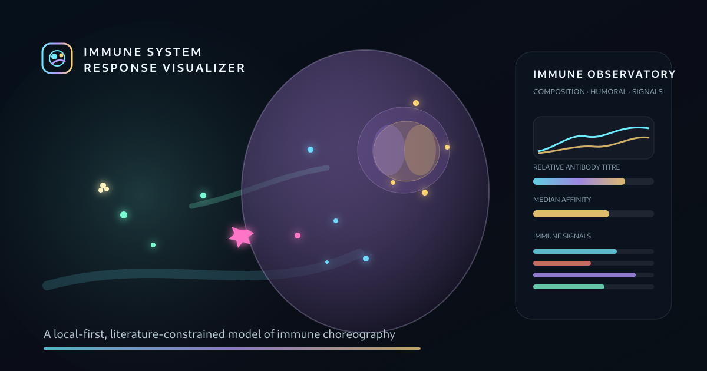

# Immune System Response Visualizer

[](https://github.com/matteobroketa/immune-system-response-visualizer/actions/workflows/pages.yml)
[](https://github.com/matteobroketa/immune-system-response-visualizer/actions/workflows/validate.yml)
[](LICENSE)

A local-first, literature-constrained visualization of immune responses across peripheral tissue, a draining lymph node, germinal centres, circulation and optional tertiary lymphoid organisation.

**Live site:** https://matteobroketa.github.io/immune-system-response-visualizer/



## What it does

The visualizer presents a continuous immune-response narrative rather than a clinical calculator. It combines a cinematic representative-agent layer with an independent weighted biological ledger.

- Explore protein-vaccine, acute viral, extracellular bacterial, recall and chronic inflammatory scenarios.
- Follow antigen drainage, innate recruitment, dendritic-cell migration, T-cell priming, expansion, contraction and memory.
- Observe follicular remodelling, germinal-centre dark/light-zone behaviour, affinity maturation and plasma-cell output.
- Compare cell composition, relative antibody titre, affinity distributions and grouped immune signalling programs.
- Inspect chronic antigen persistence, CD8 exhaustion and conditional tertiary lymphoid structure formation.
- Share complete model states through the URL and export the weighted ledger as CSV.
- Run entirely in the browser without uploads, analytics, frameworks or external runtime dependencies.

## Important interpretation boundary

Values are relative model outputs, not clinical measurements, diagnostic results or individualized predictions. Many timings are informed by murine intravital imaging, while selected humoral-response kinetics draw on human vaccination studies. See [Scientific basis](docs/SCIENTIFIC_BASIS.md) and [Model reference](docs/MODEL_REFERENCE.md).

## Repository layout

```text
.
├── index.html                         # Complete application
├── assets/
│   ├── favicon.svg
│   └── preview.png
├── docs/
│   ├── DATA_AND_API.md                # CSV schema, URL state and JS API
│   ├── DEVELOPMENT.md                 # Local development and extension guide
│   ├── MODEL_REFERENCE.md             # Equations and implementation assumptions
│   ├── SCIENTIFIC_BASIS.md            # Literature-to-feature source map
│   ├── VALIDATION.md                  # Test expectations and release checklist
│   ├── model-output-schema.csv        # Machine-readable output dictionary
│   └── parameter-source-matrix.csv    # Reusable evidence/parameter table
├── scripts/
│   ├── serve.py                       # Zero-dependency local server
│   └── validate.mjs                   # Repository integrity checks
├── .github/workflows/
│   ├── pages.yml                      # GitHub Pages deployment
│   └── validate.yml                   # Static validation
├── CITATION.cff
├── CONTRIBUTING.md
├── CHANGELOG.md
├── LICENSE
└── SECURITY.md
```

## Public model interfaces

The page exposes a small browser API:

```js
window.immuneChoreography.snapshot();
window.immuneChoreography.setDay(12);
window.immuneChoreography.play();
window.immuneChoreography.pause();
window.immuneChoreography.shareURL();
window.immuneChoreography.exportCSV();
```

See [Data and API](docs/DATA_AND_API.md) for the full CSV dictionary and URL-state parameters.


## Citation

Use the repository citation helper or the included [`CITATION.cff`](CITATION.cff).

## License

MIT. Scientific papers and external references retain their own copyrights and licenses.
